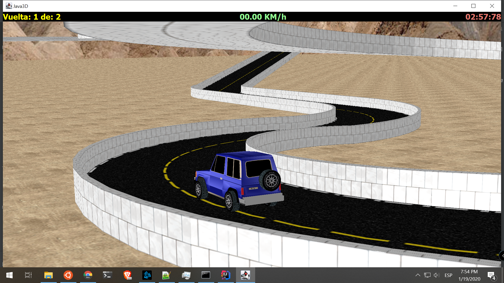

# java3d-car
very legacy university project using java3d to create a simple race track game

## Build

```
mvn package assembly:single
```

## Run

```
java -jar target/Java3dCar-1.0-SNAPSHOT-jar-with-dependencies.jar
```

## Usage

* **F5** start
* **F6** restart
* **x** exit
* **F1-F4** change camera
* **UP ARROW** accelerate
* **DOWN ARROW** brake
* **L/R ARROW** turn
* **F8** camera follows car toggle
* **Mouse Wheel** zoom in/out
* **Mouse L+Move** camera angle
* **Mouse R+Move** camera position

