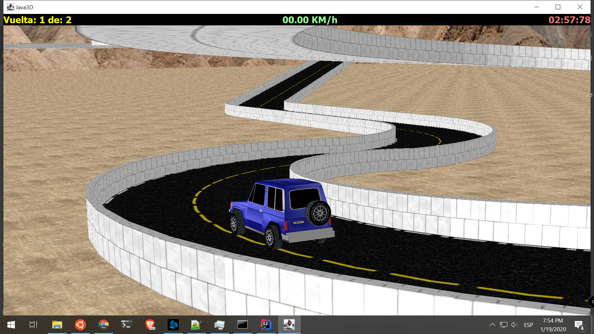

# java3d-car
very legacy university project using java3d to create a simple race track game

## Build

```
mvn package assembly:single
```

## Run

```
java -jar target/Java3dCar-1.0-SNAPSHOT-jar-with-dependencies.jar
```

## Usage

### Driving Controls
* **UP ARROW**: Accelerate (Forward)
* **DOWN ARROW**: Brake / Reverse
* **LEFT ARROW**: Steer Left
* **RIGHT ARROW**: Steer Right

### Camera & View Controls
* **F1 - F4**: Change Camera Mode (A, B, C, D)
* **F8**: Toggle Camera Movement (Follow car)
* **Mouse Wheel**: Zoom In/Out
* **Mouse Left + Move**: Rotate Camera Angle
* **Mouse Right + Move**: Adjust Camera Position

### Game Management
* **F5**: Start Game
* **F6**: Restart / Reset Car
* **F7**: Toggle Terrain Following (Gravity)
* **X**: Exit Game

### Debug / Manual Adjustment Controls
* **A / Z**: Move Car Up / Down
* **W / E**: Tilt Car Front / Back (X-axis rotation)
* **S / D**: Rotate Car Left / Right (Y-axis rotation)
* **R / F**: Tilt Car Side to Side (Z-axis rotation)

